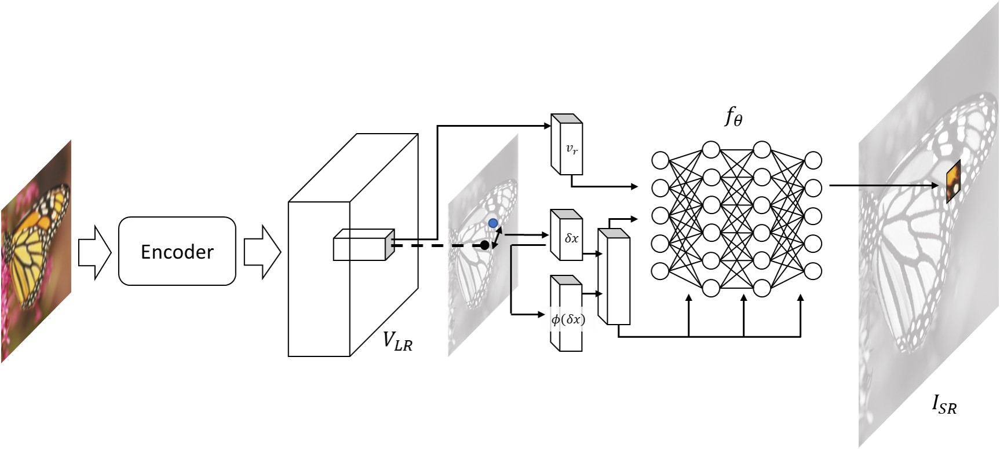
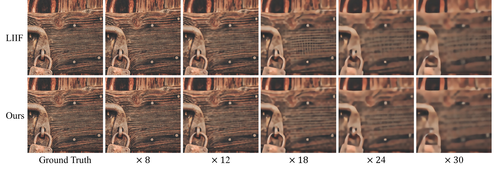
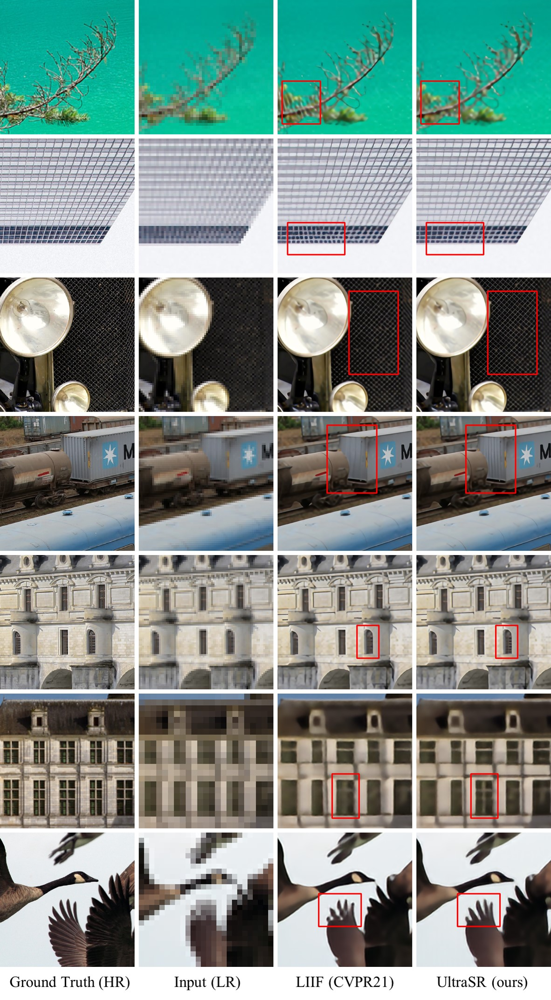

# UltraSR: Spatial Encoding is a Missing Key for Implicit Image Function-based Arbitrary-Scale Super-Resolution

Paper Link: [ArXiv Preprint](https://arxiv.org/abs/2103.12716)

By [Xingqian Xu](https://ifp-uiuc.github.io/), [Zhangyang Wang](https://vita-group.github.io/), and [Humphrey Shi](https://www.humphreyshi.com), 

[](https://www.youtube.com/watch?v=9ylD8TlSlyM)

## Introduction

<p align="center">
  
</p>

*Arbitrary-scale super-resolution* is a raising research topic with tremendous application potentials. Prior CNN-based SR approaches usually apply to only one fixed resolution scale, and thus unable to adjust their output dimension without changing the low-resolution input. Such design creates a huge gap between academic research and practical usage, and a majority of image up-sampling applications, even sensitive to precision, still heavily relied on bicubic interpolation despite its poor quality. Empowered by the rapidly advancing techniques in implicit neural representation, images and scenes can now be generalized by network-learned implicit functions on various vision topics. Specifically for our SR task, the idea that use one trained network for all zoom-in scales on any input image will bring both convenience and accuracy to downstream users in the near future. In this work, we propose **UltraSR**, a simple yet effective new network design based on implicit image functions in which spatial coordinates and periodic encoding are deeply integrated with the implicit neural representation. Our UltraSR sets new state-of-the-art performance on the DIV2K benchmark on Arbitrary-scale super-resolution. UltraSR also achieves superior performance on other standard benchmark datasets in which it outperforms prior works in almost all experiments. 

## Visualization

<p align="center">
  
</p>

<p align="center">
  
</p>

## Result

Result comparison on DIV2K validation dataset.

<table>
  <tr>
    <td align="right" style="width:130px">Method</td>
    <td align="center">x2</td>
    <td align="center">x3</td>
    <td align="center">x4</td>
    <td align="center">x6</td>
    <td align="center">x12</td>
    <td align="center">x18</td>
    <td align="center">x24</td>
    <td align="center">x30</td>
  </tr>
  <tr>
    <td align="right">Bicubic</td>
    <td align="center">31.01</td>
    <td align="center">28.22</td>
    <td align="center">26.66</td>
    <td align="center">24.82</td>
    <td align="center">22.27</td>
    <td align="center">21.00</td>
    <td align="center">20.19</td>
    <td align="center">19.59</td>
  </tr>
  <tr>
    <td align="right">EDSR</td>
    <td align="center">34.55</td>
    <td align="center">30.90</td>
    <td align="center">28.92</td>
    <td align="center">-</td>
    <td align="center">-</td>
    <td align="center">-</td>
    <td align="center">-</td>
    <td align="center">-</td>
  </tr>
  <tr>
    <td align="right">MetaSR-EDSR</td>
    <td align="center">34.64</td>
    <td align="center">30.93</td>
    <td align="center">28.92</td>
    <td align="center">26.61</td>
    <td align="center">23.55</td>
    <td align="center">22.03</td>
    <td align="center">21.06</td>
    <td align="center">20.37</td>
  </tr>
  <tr>
    <td align="right">LIIF-EDSR</td>
    <td align="center">34.67</td>
    <td align="center">30.96</td>
    <td align="center">29.00</td>
    <td align="center">26.75</td>
    <td align="center">23.71</td>
    <td align="center">22.17</td>
    <td align="center">21.18</td>
    <td align="center">20.48</td>
  </tr>
  <tr>
    <td align="right"><b>UltraSR-EDSR</b></td>
    <td align="center"><b>34.69</b></td>
    <td align="center"><b>31.02</b></td>
    <td align="center"><b>29.05</b></td>
    <td align="center"><b>26.81</b></td>
    <td align="center"><b>23.75</b></td>
    <td align="center"><b>22.21</b></td>
    <td align="center"><b>21.21</b></td>
    <td align="center"><b>20.51</b></td>
  </tr>
  <tr>
    <td align="right" >MetaSR-RDN</td>
    <td align="center"><b>35.00</b></td>
    <td align="center">31.27</td>
    <td align="center">29.25</td>
    <td align="center">26.88</td>
    <td align="center">23.73</td>
    <td align="center">22.18</td>
    <td align="center">21.17</td>
    <td align="center">20.47</td>
  </tr>
  <tr>
    <td align="right">LIIF-RDN</td>
    <td align="center">34.99</td>
    <td align="center">31.26</td>
    <td align="center">29.27</td>
    <td align="center">26.99</td>
    <td align="center">23.89</td>
    <td align="center">22.34</td>
    <td align="center">21.31</td>
    <td align="center">20.59</td>
  </tr>
  <tr>
    <td align="right"><b>UltraSR-RDN</b></td>
    <td align="center"><b>35.00</b></td>
    <td align="center"><b>31.30</b></td>
    <td align="center"><b>29.32</b></td>
    <td align="center"><b>27.03</b></td>
    <td align="center"><b>23.93</b></td>
    <td align="center"><b>22.36</b></td>
    <td align="center"><b>21.33</b></td>
    <td align="center"><b>20.61</b></td>
  </tr>
</table>

Result comparison on other 5 benchmark datasets.

<table>
  <tr>
    <td align="center" style="width:130px">Dataset</td>
    <td align="center" style="width:130px">Method</td>
    <td align="center">x2</td>
    <td align="center">x3</td>
    <td align="center">x4</td>
    <td align="center">x6</td>
    <td align="center">x8</td>
    <td align="center">x12</td>
  </tr>
  <tr>
    <td align="center" rowspan="4">Set5</td>
    <td align="center">RDN</td>
    <td align="center"><b>38.24</b></td>
    <td align="center"><b>34.71</b></td>
    <td align="center">32.47</td>
    <td align="center">-</td>
    <td align="center">-</td>
    <td align="center">-</td>
  </tr>
  <tr>
    <td align="center">MetaSR-RDN</td>
    <td align="center">38.22</td>
    <td align="center">34.63</td>
    <td align="center">32.38</td>
    <td align="center">29.04</td>
    <td align="center">29.96</td>
    <td align="center">-</td>
  </tr>
  <tr>
    <td align="center">LIIF-RDN</td>
    <td align="center">38.17</td>
    <td align="center">34.68</td>
    <td align="center"><b>32.50</b></td>
    <td align="center">29.15</td>
    <td align="center">27.14</td>
    <td align="center"><b>24.86</b></td>
  </tr>
  <tr>
    <td align="center"><b>UltraSR-RDN</b></td>
    <td align="center">38.21</td>
    <td align="center">34.67</td>
    <td align="center">32.49</td>
    <td align="center"><b>29.33</b></td>
    <td align="center"><b>27.24</b></td>
    <td align="center">24.81</td>
  </tr>
</table>

## License

## Citation

```bibtex
@article{xu2021ultrasr,
  title={UltraSR: Spatial Encoding is a Missing Key for Implicit Image Function-based Arbitrary-Scale Super-Resolution},
  author={Xingqian Xu and Zhangyang Wang and Humphrey Shi},
  journal={arXiv preprint arXiv:2103.12716},
  year={2021}
}
```

## Acknowledgements
Our work benefited greatly from [LIIF](https://github.com/yinboc/liif) (CVPR 2021) etc. We thank the authors for sharing their codes.

